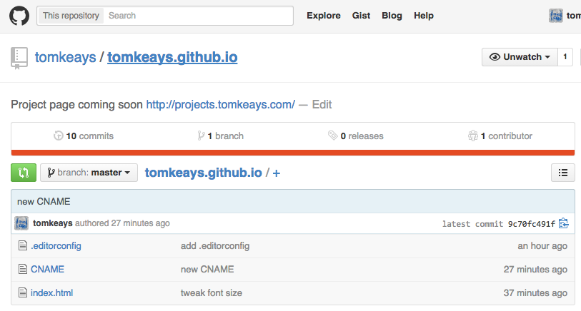

# Setting up projects.tomkeays.com

**Goal**: to have the URL [http://projects.tomkeays.com](projects.tomkeays.com) point to my [https://github.com/tomkeays/tomkeays.github.io](github.com/tomkeays/tomkeays.github.io) GitHub Pages repo.

## 1. Create a CNAME file

The CNAME file 

